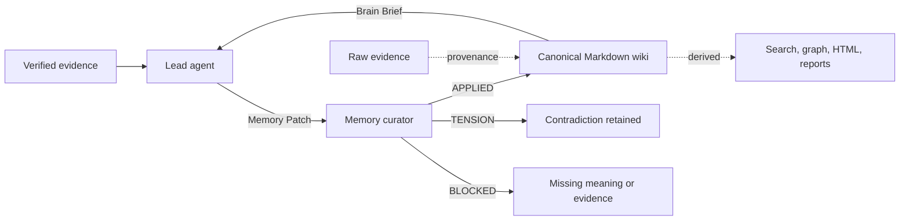

# Memory Patch Harness

[](https://github.com/Grunte12/memory-patch-harness/actions/workflows/ci.yml)
[](LICENSE)

An evidence-informed memory layer for coding agents.

Status: experimental pre-1.0. The contracts and evals are usable, but live-model benchmark results are not published yet.

The harness separates two responsibilities:

- The lead agent decides what a completed task means and authors a structured Memory Patch.
- A memory curator retrieves, validates, links, and stores that patch without inventing missing facts.

This prevents a common failure mode: asking a second agent with less task context to reconstruct the lesson from a vague summary.

## Why This Exists

Long-running agents need durable memory, but saving every conversation creates noise and repeatedly rewriting summaries can corrupt useful evidence. This harness uses four controls:

1. **Significance gate**: save only knowledge that can change future work.
2. **Semantic ownership**: the agent with the full task context authors the memory claim.
3. **Curator boundary**: the memory agent organizes and validates; it does not invent.
4. **Bounded recall**: future tasks receive a compact Brain Brief and a few exact note paths.

## Architecture



Raw evidence is the immutable evidentiary source of truth. Markdown is canonical operational memory: an agent-maintained synthesis that must remain traceable to evidence. Search indexes, knowledge graphs, and generated reports are rebuildable derived views.

## Quick Start

Requirements: Node.js 20 or newer.

```powershell
git clone https://github.com/Grunte12/memory-patch-harness.git
cd memory-patch-harness
npm test
node scripts/install.mjs --target "$HOME/.config/opencode"
```

The installer copies only the `memory-curator` skill. It does not overwrite `opencode.json` or agent prompts. Review the generated instructions, then apply the files under `adapters/opencode/`.

Initialize a project memory area:

```powershell
node scripts/init-project.mjs `
  --vault "C:\path\to\your\ObsidianVault" `
  --project "my-project"
```

Validate a patch:

```powershell
node scripts/validate.mjs examples/memory-patch.json
node scripts/validate.mjs examples/derived-index.json
node scripts/validate.mjs examples/hot-context-pack.json
node scripts/validate.mjs examples/learning-packet.json
node scripts/render-hot-context.mjs --pack examples/hot-context-pack.json --out tmp/hot-context.md
```

Run the retrieval and memory benchmarks:

```powershell
npm run eval
node scripts/eval-retrieval.mjs --dataset eval/fixtures --k 3 --json tmp/report.json
node scripts/eval-curator.mjs --candidate eval/curator/candidate.memory-patch.json
npm run eval:curator:compare
npm run eval:learning-loop
npm run eval:future-task
npm run eval:report
node scripts/eval-agent-run.mjs --curator-output eval/curator/candidates/C-memory-patch.json --patches eval/patch-quality/candidates
```

The retrieval benchmark compares dependency-free lexical and BM25 baselines using Hit@k, Recall@k, MRR, nDCG, and retrieved context size. The curator benchmark checks Brain Brief and Memory Patch behavior: bounded recall, provenance retention, conflict surfacing, noise rejection, and derived-artifact boundaries. The comparison script scores proxy baselines for direct writing, curator inference, and Memory Patch handoff. The learning-loop eval adds token/cost proxies and a future-task utility check. `npm run eval:report` writes a generated summary to `tmp/eval-report.md`. These are evaluation surfaces, not production retrievers.

## Guides

- [Installation](docs/install.md): install the skill and adapt it to OpenCode or any other coding agent.
- [Demo Workflow](docs/demo-workflow.md): see one realistic task become a Memory Patch, Brain Brief, and Hot Context Pack.
- [Live Model Evaluation](docs/live-model-eval.md): compare real model outputs against the deterministic evaluator.
- [Live Model Results](docs/live-model-results.md): publish real model results separately from proxy fixtures.
- [Evaluation](docs/evaluation.md): understand the retrieval, curator, patch-quality, and baseline comparison checks.
- [Learning Loop](docs/learning-loop.md): v0.3 contract for verified behavior-changing lessons.
- [คู่มือแนวคิดภาษาไทย](docs/thai-strategy-guide.md): อธิบาย strategy, process, use cases, trade-offs, และข้อจำกัดของ Memory Patch Harness สำหรับผู้ใช้ไทย.
- [Repository Patterns](docs/repository-patterns.md): how this repo borrows packaging patterns from agent-tool projects without adding heavy dependencies.

## Project Health

- License: [MIT](LICENSE)
- Changelog: [CHANGELOG.md](CHANGELOG.md)
- Privacy policy: [PRIVACY.md](PRIVACY.md)
- Security policy: [SECURITY.md](SECURITY.md)
- Support policy: [SUPPORT.md](SUPPORT.md)
- Contributing guide: [CONTRIBUTING.md](CONTRIBUTING.md)
- Citation metadata: [CITATION.cff](CITATION.cff)

## Memory Patch

```json
{
  "claim": "Visual verification belongs to the agent that owns visible UI.",
  "why_it_matters": "Future routing should not send UI correctness checks to backend agents.",
  "scope": {
    "applies": ["visible UI implementation and review"],
    "excludes": ["API, data, and build verification"]
  },
  "provenance": [
    {
      "kind": "file",
      "value": "AGENTS.md"
    }
  ],
  "confidence": "high",
  "suggested_type": "decision",
  "lifecycle": {
    "status": "active",
    "revalidate_when": ["ownership policy changes"],
    "supersedes": []
  }
}
```

The curator returns one status:

- `APPLIED`: memory was merged or created with provenance.
- `TENSION`: an active note disagrees; both positions remain visible.
- `BLOCKED`: the patch lacks sufficient meaning, scope, or evidence.

## Derived Index

A derived index is an optional source map generated from files, notes, or code. It can help retrieval, but it is never canonical memory.

```json
{
  "role": "derived-index",
  "canonical_memory": false,
  "generator": {
    "name": "example-local-indexer"
  },
  "derived_from": [
    {
      "kind": "file",
      "value": "notes/00 Project Home.md"
    }
  ],
  "entries": [
    {
      "id": "note:visual-verification",
      "kind": "note",
      "label": "Visual verification policy note",
      "confidence": "high",
      "evidence_refs": [
        {
          "kind": "file",
          "value": "notes/visual-verification.md"
        }
      ]
    }
  ]
}
```

The contract is deliberately tool-agnostic. A graph, search index, source map, or generated report can implement it without becoming a dependency of this harness. Durable memory still changes only through a Memory Patch.

## Hot Context Pack

A Hot Context Pack is a compact derived prompt-prefix candidate for stable, frequently used memory. It is useful for provider prompt caching and repeated agent sessions, but it is not canonical memory.

```powershell
node scripts/render-hot-context.mjs --pack examples/hot-context-pack.json
```

Only high-utility active memory should enter this pack: current policies, preferences, routing rules, gotchas, stale warnings, and open questions. Each entry must point back to canonical notes and include lifecycle metadata so the pack can be regenerated or invalidated.

## Brain Brief

A Brain Brief contains:

- 1-7 relevant memory items
- constraints that affect the next handoff
- stale or contradictory notes to watch
- 0-3 exact note paths for optional direct reading

The lead agent should not browse the whole vault. It asks the curator to retrieve the smallest useful set.

## Repository Map

```text
adapters/opencode/       OpenCode integration examples
docs/                    Architecture, research, and evaluation
examples/                Valid example contracts
schemas/                 Machine-readable JSON Schema
scripts/                 Install, initialize, and validate
skills/memory-curator/   Installable on-demand agent skill
src/                     Dependency-free validation logic
test/                    Deterministic contract tests
```

## What Is Original Here

This repository is an original integration, not a claim to have invented agent memory or LLM wikis. Its distinct contribution is the contract between:

- lead-agent semantic authorship,
- curator-limited write authority,
- explicit `APPLIED/TENSION/BLOCKED` outcomes,
- provenance-preserving patches,
- lifecycle and stale-revalidation metadata,
- bounded Brain Brief retrieval,
- optional Derived Index and Hot Context Pack contracts,
- and deterministic contract audits.

See [Research Foundations](docs/research-foundations.md) for sources and [Evaluation](docs/evaluation.md) for retrieval and curator behavior checks.

See [Repository Patterns](docs/repository-patterns.md) for why optional graph, compression, MCP, and HTML layers are kept outside the core contracts.

## Is This Agentic RAG?

Not yet in the conventional engineering sense.

The current harness provides **agent-controlled memory retrieval**: a curator decides which linked Markdown notes are relevant and returns a bounded Brain Brief. It does not currently provide document chunking, embeddings, a vector or BM25 index, hybrid retrieval, reranking, or an iterative retrieval-quality loop.

The most accurate description is:

> **Agentic memory retrieval with an evidence-grounded compiled wiki, designed to become RAG-enabled when scale and measured retrieval failures justify it.**

Read the bilingual guide: [Where This Fits in the RAG Landscape / ระบบนี้อยู่ตรงไหนในโลกของ RAG](docs/rag-positioning.md).

The first synthetic retrieval baseline is documented in [Evaluation](docs/evaluation.md). It found no Recall@3 improvement from BM25 over lexical retrieval, so BM25 remains an experimental baseline rather than a default dependency.

See [Cost and Scale / ต้นทุนและการขยายระบบ](docs/cost-and-scale.md) for private real-vault results, honest vector-RAG trade-offs, and the current scalability boundary.

See [Research Source Map / แผนที่แหล่งวิจัย](docs/research-source-map.md) for adopted evidence, discovery-only sources, and sources excluded as irrelevant.

See [Independent NotebookLM Review](docs/notebooklm-review.md) for the neutral research pass, seeded critique, accepted changes, and rejected overreach.

## License

MIT. Research papers and referenced projects remain under their own terms. See [THIRD_PARTY_NOTICES.md](THIRD_PARTY_NOTICES.md).
